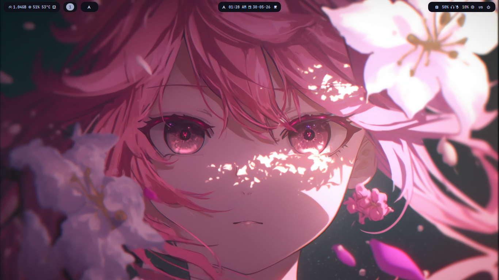
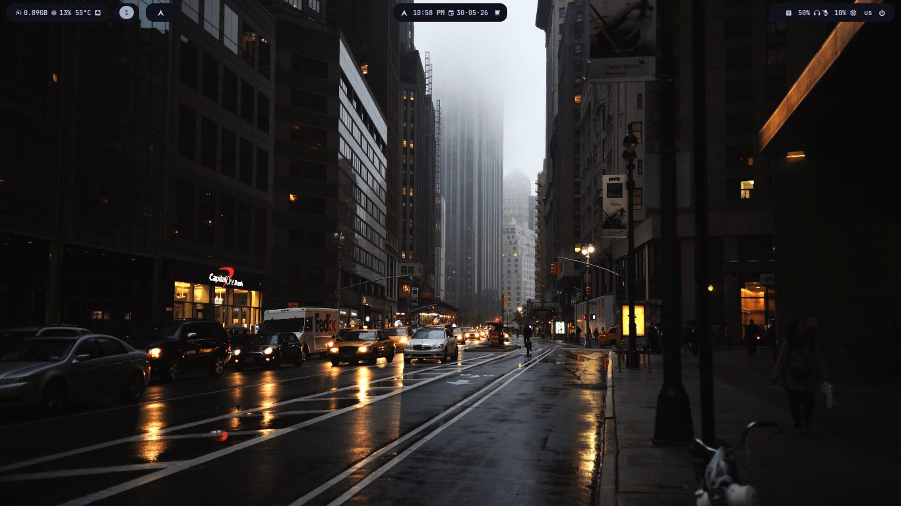
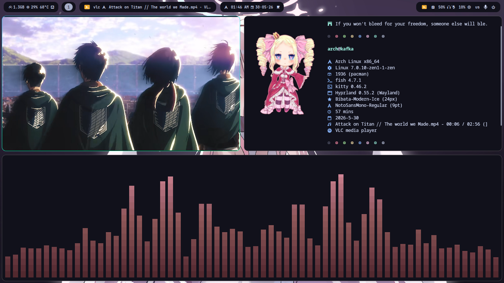
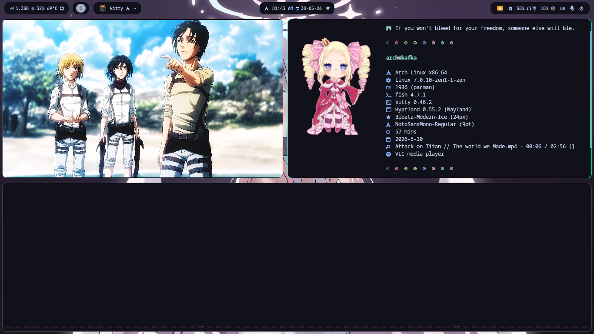
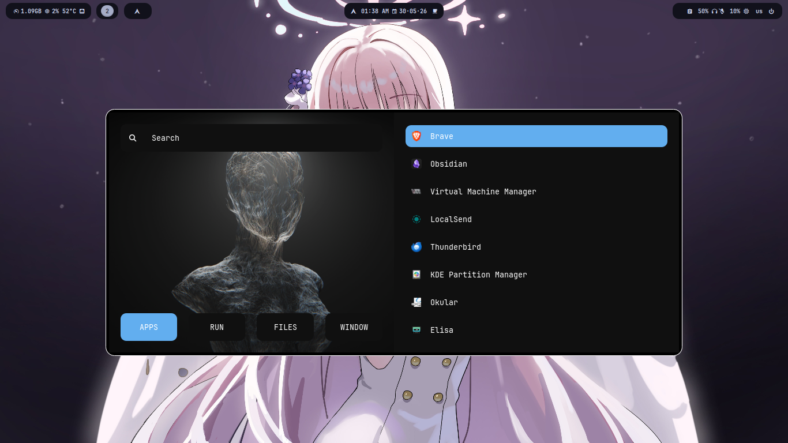

<div align="center">

# ꩜ dotfiles

**Hyprland configuration for Arch Linux**


</div>

---

## 📸 Screenshots








---

## 🧩 Stack

| Role              | App                  |
|-------------------|----------------------|
| Compositor        | Hyprland             |
| Bar               | Waybar               |
| Launcher          | Rofi                 |
| Terminal          | Kitty                |
| Shell             | Fish                 |
| Notifications     | Mako                 |
| Lock screen       | Hyprlock             |
| Idle daemon       | Hypridle             |
| Logout menu       | Wlogout              |
| Fetch             | Fastfetch            |
| GTK Theme         | Breeze-Dark          |
| Icons             | Tela-purple-dark     |
| Font              | JetBrains Mono       |

---

## 📁 Structure

```
dotfiles/
├── config/
│   ├── hypr/        # Hyprland, Hyprlock, Hypridle
│   ├── waybar/      # Bar config and CSS
│   ├── rofi/        # Launcher theme
│   ├── kitty/       # Terminal config
│   ├── mako/        # Notification daemon
│   ├── fish/        # Shell config
│   ├── fastfetch/   # Fetch config
│   ├── gtk-3.0/
│   ├── gtk-4.0/
│   └── wlogout/
├── themes/          # Breeze-Dark GTK theme
├── icons/           # Tela-purple-dark icons
├── wallpapers/
└── scripts/
    ├── ignite        # Session/startup script
    ├── kagiana       # (see below)
    ├── archsync.sh   # System update helper
    ├── random_profile
    ├── random_profile.py
    └── sddm-background.sh
```

---

## ⚡ Scripts

- **`kagiana`** — see [outisdz/Kagiana](https://github.com/outisdz/Kagiana)
- **`ignite`** —  Session/startup script
- **`archsync.sh`** — Syncs and updates the system packages
- **`random_profile`** — Randomizes profile see [outisdz/random-profile-generator](https://github.com/outisdz/random-profile-generator.git)
- **`sddm-background.sh`** — Sets SDDM login screen background

---

## 🚀 Installation

### 1. Clone the repo

```bash
git clone https://github.com/outisdz/dotfiles.git ~/dotfiles
cd ~/dotfiles
```

### 2. Install dependencies

```bash
# Official repos
sudo pacman -S hyprland waybar rofi kitty mako hyprlock hypridle fastfetch fish hyprpaper

# AUR
paru -S wlogout
```

### 3. Apply

```bash
bash install.sh
```

This will:
- Copy `config/` → `~/.config/`
- Copy `themes/` → `~/.themes/`
- Copy `icons/` → `~/.icons/`
- Copy `wallpapers/` → `~/wallpapers/`
- Copy scripts to `/usr/local/bin/`

---

<div align="center">
  Built on Arch Linux
</div>
